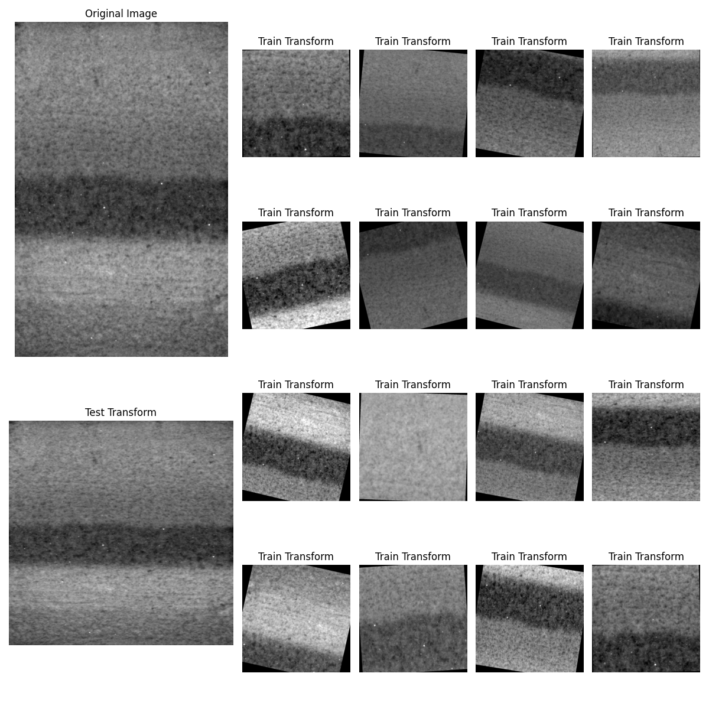

# Segmentation of Near-Infrared Snowpack Images Using Deep Learning

## Description

This repository fine-tunes SAM2 to segment near-infrared (NIR) images of snowpacks into different layers.

## Acknowledgements

This repository relies on Francis Pelletier's repository template, licensed under MIT. Our model uses SAM2, licensed under Apache-2.0. We thankfully the authors for making their code publicly available.
 
## Python Version

This project uses Python version 3.10 and up.

## Build Tool

This project uses `poetry` as a build tool. Using a build tool has the advantage of 
streamlining script use as well as fix path issues related to imports.

## Quick setup

This is a short step by step, no nonsense way of setting things up and start working 
right away. 

For more in depth information, read the other sections below, starting at the 
[Detailed documentation section](#detailed-documentation).

**Reminder:** When working on the clusters, you will always need to load the 
appropriate module before you can activate your environment
* For python virtual environments: `module load python/<PYTHON_VERSION>`
* For conda environments : `module load miniconda/3`

### Install poetry

Skip this step if `poetry` is already installed. 

See [Installing Poetry as a Standalone section](docs/poetry_installation.md#installing-poetry-as-a-standalone-tool) 
 if working on a compute cluster.

1. Install pipx `pip install pipx` 
2. Install poetry with pipx: `pipx install poetry`

### Create project's virtual environment

1. Read the documentation on the specific cluster if required:
   * [How to create a virtual environment for the Mila cluster](docs/environment_creation_mila.md)
   * [How to create an environment for the DRAC cluster](docs/environment_creation_drac.md) 
2. Create environment : `virtualenv <PATH_TO_ENV>`
   * Or, using venv : `python3 -m venv <PATH_TO_ENV>`
3. Activate environment : `source <PATH_TO_ENV>/bin/activate`

Alternatively, if you want or need to use `conda`:

1. Read the documentation about [conda environment creation](docs/conda_environment_creation.md)
2. Create the environment : `conda env create python=<PYTHON_VERSION_NUMBER> -n <NAME_OF_ENVIRONMENT>`
3. Activate environment : `conda activate <NAME_OF_ENVIRONMENT>`

### Install

1. Install the snowpack package : `poetry install`
2. Initialize pre-commit : `pre-commit install`

### Development

1. [Add required dependencies](./CONTRIBUTING.md#adding-dependencies)
2. Create some new modules in the [src](src/) folder!

## Detailed documentation

### Environment Management

This section and those following go into more details for the different setup steps.

Your project will need a virtual environment for your dependencies.

* [How to create a virtual environment for the Mila cluster](docs/environment_creation_mila.md)
* [How to create an environment for the DRAC cluster](docs/environment_creation_drac.md)
* [How to create a Conda environment](docs/conda_environment_creation.md)
* [Migrating to DRAC from another environment](docs/migrating_to_drac.md)

There are different ways of managing your python version in these environments. On the 
clusters, you have access to different python modules, and through `conda` you have access 
to practically all the python versions that exist. 

However, on your own system, if you do not wish to use `conda`, you will have to either 
manually install different versions of python manually for them to be usable by `poetry` 
or use a tool like [pyenv](https://github.com/pyenv/pyenv).

Do note that `conda` is not available on the DRAC cluster, and there are some extra steps
to use `conda` on the Mila cluster compared to a workstation.

Once you know in which environment you will be working, we can proceed to install `poetry`.

`poetry` can be installed a number of ways, depending on the environment choice, and if
you are working on your local machine vs a remote cluster. See the following 
documentation to help you determine what is best for you.

* [How to install poetry](docs/poetry_installation.md)

### Installation

Once the virtual environment is built and `poetry` is installed, follow these steps to 
install the package's dependencies:

1. Make sure your virtual environment is active
2. Install the package and its dependencies using the following command:
    * `poetry install`
    * Alternatively, you can also install using `pip install -e .`, which will install 
      your package, [configured scripts](https://python-poetry.org/docs/pyproject#scripts) 
      and dependencies, but without creating a `poetry.lock` file.

### Development

If you want to contribute to this repository, the development dependencies will also need to added.

1. Install `pre-commit` and other dev dependencies using the following command:
   * `poetry install --with dev`
     * `pre-commit` is used for code quality and code analysis
   * Configure `pre-commit` by running the following command: `pre-commit install`
2. Optional Pylint check
   * While not enforced by the pre-commit tool, running Pylint on your code can help
     with code quality, readability and even catch errors or bad coding practices.
   * To run this tool : `pylint src/ scripts/ tests/`
   * For more information, see the [Pylint library](https://pylint.readthedocs.io/en/stable/)
3. Optional Cyclomatic Complexity check (McCabe)
   * While not enforced by the pre-commit tool, running a complexity check on your code can help
     with code quality, readability and even catch errors or bad coding practices.
   * To run this tool : `flake8 --max-complexity 7 src/ tests/ scripts/`
   * For more information, see [McCabe Checker](https://github.com/PyCQA/mccabe)
4. Python library dependencies
   * To keep things simple, it is recommended to store all new dependencies as main 
     dependencies, unless you are already familiar with dependency management. 
5. Read and follow the [Contributing guidelines](CONTRIBUTING.md)

## Pre-training Checkpoints

Download the SAM2 pre-training checkpoints by running:

`!wget -O sam2_hiera_tiny.pt "https://dl.fbaipublicfiles.com/segment_anything_2/072824/sam2.1_hiera_tiny.pt"`
`!wget -O sam2_hiera_small.pt "https://dl.fbaipublicfiles.com/segment_anything_2/072824/sam2.1_hiera_small.pt"`

Please store the checkpoints in `snowpack/model/model_checkpoints`.

## Settings

For the experiments presented here, we use SAM as the backbone model. We also use data augmentation, which you can find in the pipeline at `snowpack/augmentations.py`. To see a sample, you can run `tests/augmentation_test.py`. The result of such a test is given on a sample data seen in the figure below:

